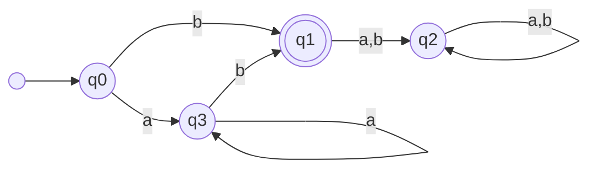
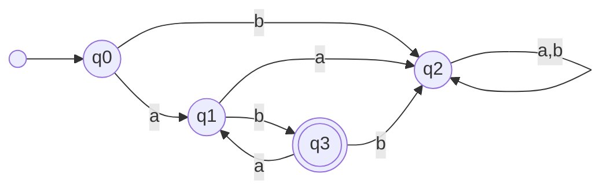
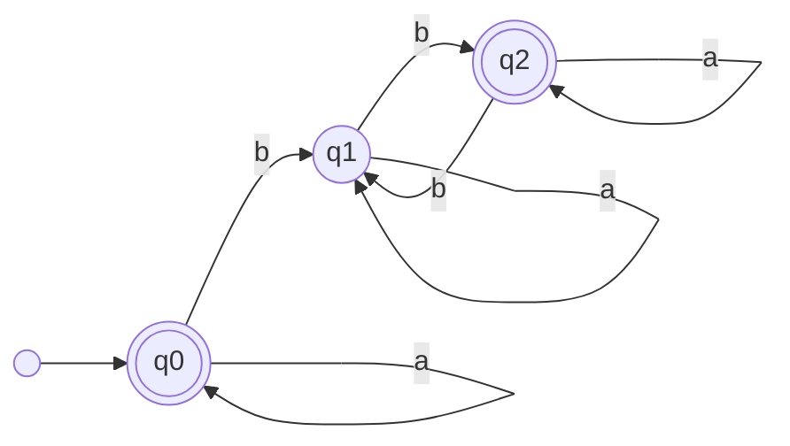

# Autómatas

Una máquina abstracta que nos permite decidir si una cadena forma parte de un lenguaje es un autómata finito. Está conformado por la tupla $\Sigma,Q,s,F,f:Qx\Sigma\rightarrow Q$

+ $\Sigma$ es un alfabeto
+ $Q$ es un conjunto de estados
+ $s$ es un estado inicial
+ $F$ es un conjunto de estados finales
+ $f$ función $Qx\Sigma\rightarrow Q$

### Ejemplo 1

> $\Sigma=\{ a,b \}$  
> $L=a^*$  
> $Q=\{ q_0,q_1 \}$  
> $F=\{ q_0 \}$  
> $s=\{ q_0 \}$

|  | a | b |
|---|---|---|
| q0 | q0 | q1 |
| q1 | q1 | q1 |

### Ejemplo 2

> $\Sigma=\{ 0,1 \}$  
> $L=\{ 0|10^* \}$  
> $s=\{ q_0 \}$  
> $Q=\{ q_0,q_1,q_2,q_3 \}$  
> $F=\{ q_1,q_3 \}$  

|  | 0 | 1 |
|---|---|---|
| q0 | q1 | q3 |
| q1 | q2 | q2 |
| q2 | q2 | q2 |
| q3 | q3 | q2

### Ejemplo 3

> $\Sigma=\{ a,b \}$  
> $L=\{ a^kb | k\geq 0 \}$  
> $s=\{ q_0 \}$  
> $Q=\{ q_0,q_1,q_2,q_3 \}$  
> $F=\{ q_1 \}$  

|  | a | b |
|---|---|---|
| q0 | q3 | q1 |
| q1 | q2 | q2 |
| q2 | q2 | q2 |
| q3 | q3 | q1 | 

### Ejemplo 4

> $\Sigma=\{ a,b \}$  
> $L=\{ (ab)^k | k>0 \}$  
> $s=\{ q_0 \}$  
> $Q=\{ q_0,q_1,q_2,q_3 \}$  
> $F=\{ q_3 \}$  

|  | a | b |
|---|---|---|
| q0 | q1 | q2 |
| q1 | q2 | q3 |
| q2 | q2 | q2 |
| q3 | q1 | q2 | 

### Ejemplo 5

> $\Sigma=\{ a,b \}$  
> $L=\{ Número par de b's \rightarrow a^*(ba^*ba^*)^*\}$  
> $s=\{ q_0 \}$  
> $Q=\{ q_0,q_1,q_2 \}$  
> $F=\{ q_0,q_2 \}$  

|  | a | b |
|---|---|---|
| q0 | q0 | q1 |
| q1 | q1 | q2 |
| q2 | q2 | q1 | 

