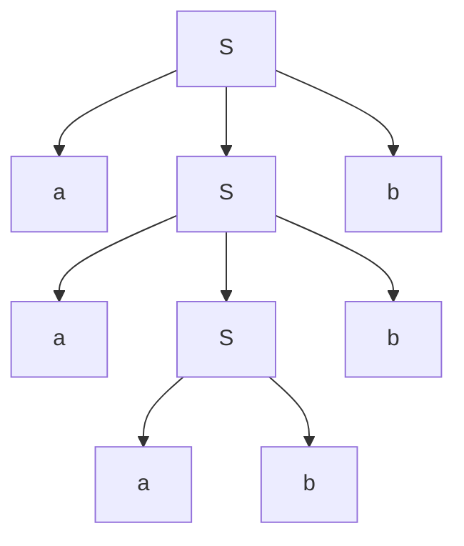
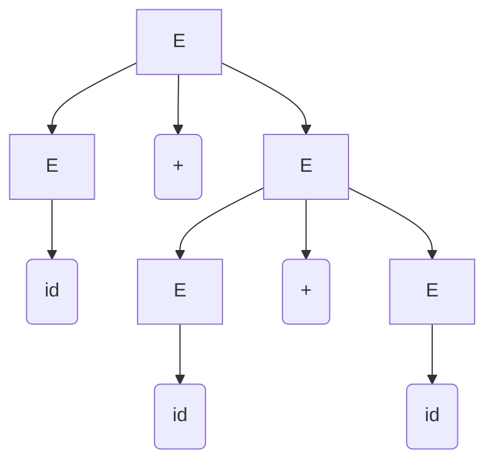
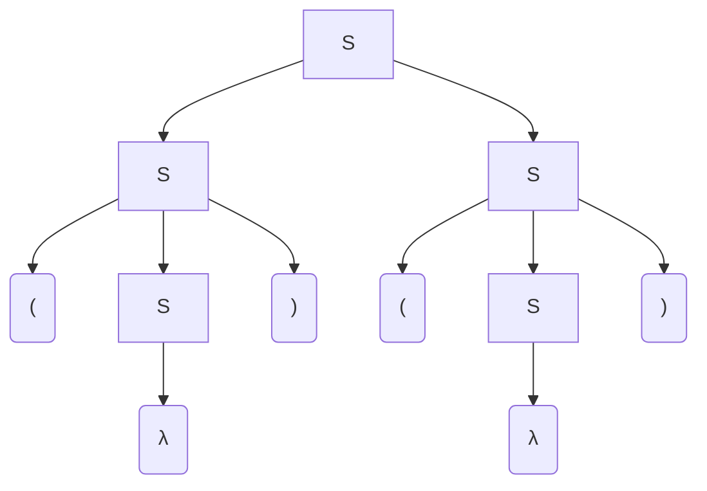

# Derivación

Una derivación consiste en aplicar reglas de producción de la gramática hasta obtener una cadena formada únicamente por símbolos terminales. 

Ejemplo:s
> $S\rightarrow aSb|ab$

Derivación
> $S\rightarrow aSb \rightarrow aaSbb \rightarrow aaabbb$

## Derivación por la izquierda
El no terminal que se deriva es aquel más a la izquierda  
Ejemplo:
> $E \rightarrow E+E | id$

Derivación por la izquierda
> $E\rightarrow E+E \rightarrow E+E+E\rightarrow id+E+E\rightarrow id+id+E\rightarrow id+id+id$

## Derivación por la derecha
El no terminal que se deriva es aquel más a la derecha  
Ejemplo:
> $E\rightarrow E+E\rightarrow E+E+E\rightarrow E+E+id\rightarrow E+id+id\rightarrow id+id+id$

## Árbol de derivación
Un árbol de derivación representa de forma jerárquica la aplicación de las reglas de producción donde:
- La raíz del árbol corresponde al símbolo inicial
- Los nodos internos corresponden a símbolos no terminales
- Las hojas corresponden a símbolos terminales

> $S\rightarrow aSb | ab$  
> $S\rightarrow aSb\rightarrow aaSbb\rightarrow aaabbb$  
>
> Si tomamos las hojas del siguiente árbol podemos generar la cadena buscada




> $E\rightarrow E+E\rightarrow id+E\rightarrow id+E+E\rightarrow id+id+E\rightarrow id+id+id$



> Si obtenemos árboles distintes al hacer derivaciones por la izquierda y por la derecha podemos decir que hay ``` ambiguedad ```

Ejemplo:
> $S\rightarrow if\space E\space then\space S|if\space E\space then\space S\space else\space S|a$  
>
> Cadena a generar ```if E then if E then a else a```
>
> $S\rightarrow ifEthenS\rightarrow if\space E\space then\space if\space E\space then\space S\space else\space S\rightarrow if\space E\space then\space if\space E\space then\space a\space else\space S\rightarrow if\space E\space then\space if\space E\space then\space a\space else\space a$

Ejercicio:
> Gramática  
> $S\rightarrow SS | (S) | \lambda$  
>
> Cadena a generar ```()()```

### Derivación por la izquierda
> $S\rightarrow SS\rightarrow (S)S\rightarrow (\lambda)S\rightarrow ()(S)\rightarrow ()(\lambda)$



### Derivación por la derecha
> $S\rightarrow SS\rightarrow S(S)\rightarrow S(\lambda)\rightarrow (S)()\rightarrow (\lambda)()$