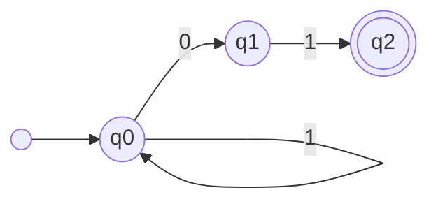
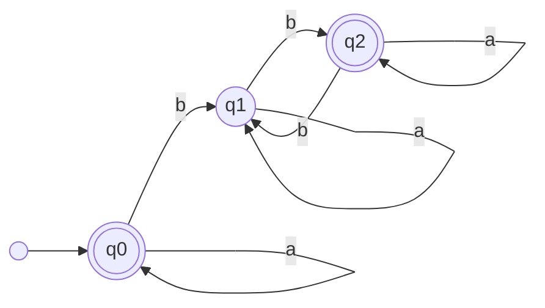

### Ejercicio 1

> $\Sigma=\{ 0,1 \}$  
> L=\{ Cadenas que contengan la subcadena 01 \}  
> $s=\{ q_0 \}$  
> $Q=\{ q_0,q_1,q_2 \}$  
> $F=\{ q_0,q_2 \}$  

|  | 0 | 1 |
|---|---|---|
| q0 |  |  |
| q1 |  |  |
| q2 |  |  | 

### Ejercicio 2

> $\Sigma=\{ 0,1 \}$  
> L=\{ Cadenas que No contengan la subcadena 01\}  
> $s=\{ q_0 \}$  
> $Q=\{ q_0,q_1,q_2 \}$  
> $F=\{ q_0,q_2 \}$  

|  | 0 | 1 |
|---|---|---|
| q0 |  |  |
| q1 |  |  |
| q2 |  |  | 

### Ejercicio 3

> $\Sigma=\{ a,b,c \}$  
> L=\{ Cadenas que inician con la subcadena ac o terminan con la subcadena ab \}  
> $s=\{ q_0 \}$  
> $Q=\{ q_0,q_1,q_2 \}$  
> $F=\{ q_0,q_2 \}$  

|  | a | b | c | 
|---|---|---|---|
| q0 |  |  |  |
| q1 |  |  |  |
| q2 |  |  |  |

### Ejercicio 4

> $\Sigma=\{ a,b,c \}$  
> L=\{ Inician con la subcadena ac y terminan con la subcadena ab \}  
> $s=\{ q_0 \}$  
> $Q=\{ q_0,q_1,q_2 \}$  
> $F=\{ q_0,q_2 \}$  

|  | a | b | c | 
|---|---|---|---|
| q0 |  |  |  |
| q1 |  |  |  |
| q2 |  |  |  |

